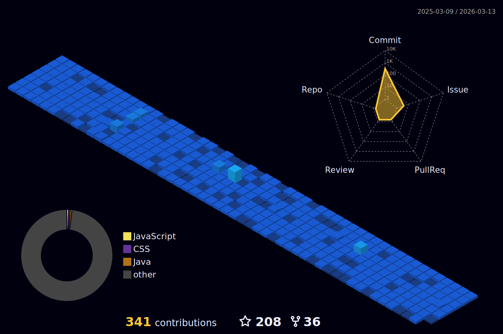

<!--Header

-->

 

 

<!--Intro-->
 
## 𝐇𝐞𝐥𝐥𝐨 𝐭𝐡𝐞𝐫𝐞, 𝐟𝐞𝐥𝐥𝐨𝐰 <𝚌𝚘𝚍𝚎𝚛 />! 

### Congratulations you found me

- 👨‍💻 I’m currently working on web development technologies like `Spring Boot`, `React`, `Angular` etc.
- 📚 I’m currently learning **React Native, Selenium and Machine Learning technologies** 😅
- 💪🏼 Future Goals: Learn more technologies - Never stop creating new ideas.

<!--Contact-->

### Contact me:

  
  
  
  
   
  

<!--Skills-->

 

<h3 align="center">
 
 
 
 【Ｓｋｉｌｌｓ】  
</h3>

 
  

| **Programming Languages**                           | **Frontend**                                      | **Backend**                                       | **Database**                                      | **IDEs/Softwares**                                           | **Other_Tools**                                    |
| --------------------------------------------------- | -------------------------------------------------- | -------------------------------------------------- | -------------------------------------------------- | ---------------------------------------------------- | -------------------------------------------------- |
| 
 
| 
  
| 
 | 
 |
  | 
  |
| 
 | 
 | 
 | 
 |
  | 
  |
| 
 | 
 | 
 |
  | 
 |
   |
|
  | 
 |
  |                                                   |
  | 
  |
| 
 | 
 | 
 |                                                  |
  |
   |
| 
 |
  |
  |                                                   | 
  |                                                   |
|                                                   |
  |
  |                                                   |                                                   |                                                   |

<!--STATS-->

<h3 align="center">
   【Ｓｔａｔｓ】 

</h3>

 
 

  

 <!--More Stats-->
 

  
📈 More Stats

   

  

   

  
  
   

---   

 <a href="https://github.com/walidbosso"> 
   
   
 </a>
<a href="https://github.com/walidbosso"> 
   
  </a> 
  
    
  
 

  

 

  
 

<!--SNAKE-->

<!-- add `p` for margin-bottom -->

<!--More REPOSITORIES-->

  
📁 More Repositories

   

  

      

 

### 𝚂𝚑𝚘𝚠 𝚜𝚘𝚖𝚎 💙 𝚋𝚢 𝚜𝚝𝚊𝚛𝚛𝚒𝚗𝚐 ⭐ 𝚜𝚘𝚖𝚎 𝚘𝚏 𝚝𝚑𝚎 𝚛𝚎𝚙𝚘𝚜𝚒𝚝𝚘𝚛𝚒𝚎𝚜!

 

 

<!--SPOTIFY-->

<a href="https://github.com/walidbosso">

  
 <h4 align="center">
  Currently Coding and Listening to  
</h4>

  
</a>

 

  
  

 

<!--THANKS-->

 

  

<!--

    
 
-->

<!--
#### Programming Languages:

-->
 <!--
#### Web Development:

-->
<!--

--> 
<!--
#### Database:

--> 
<!--
#### Other Tools:

-->
