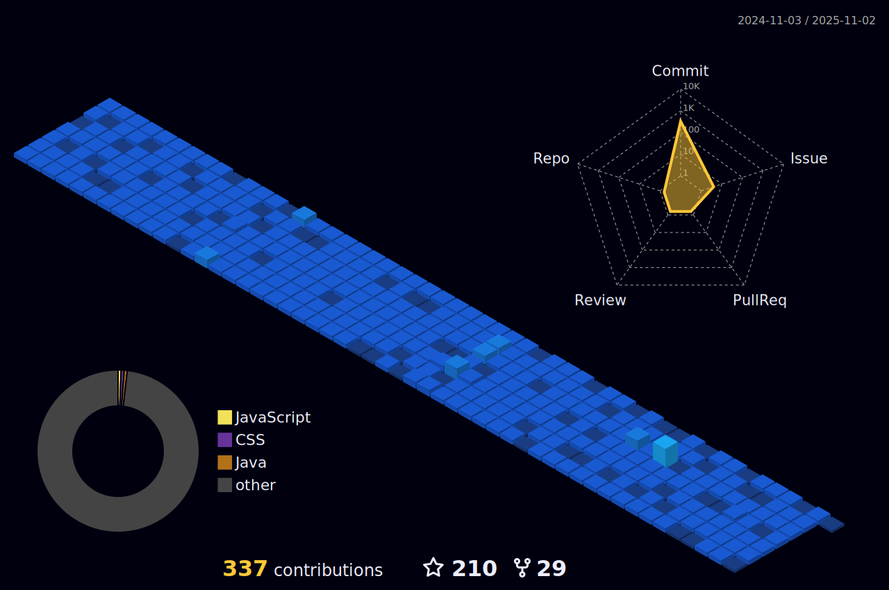

 
 <!--Header-->

 

 

 

<!--Intro-->

 
## 𝐇𝐞𝐥𝐥𝐨 𝐭𝐡𝐞𝐫𝐞, 𝐟𝐞𝐥𝐥𝐨𝐰 <𝚌𝚘𝚍𝚎𝚛 />! 

> [!CAUTION]
> - 🔖 Congratulations you found me

> [!NOTE]
> - 🚙 I’m currently working on web development technologies like `Spring Boot`, `Angular`, `React` etc.

> [!IMPORTANT]
> - 📚 I’m currently learning **Docker, Jenkins and Grafana** 😅

> [!WARNING]  
> - 💪🏼 Future Goals: Learn more technologies, starting next with **SAP Commerce** - Never stop creating new ideas.

> [!TIP]  
> - 📗 If you're interested in collaborating or have any questions — I'd love to hear from you!

> 

>  
>   
>   
> <!--    -->
>    
>   
>  
> 

---

<!--Skills-->

 

<h3 align="center">
 
 
 
 【Ｓｋｉｌｌｓ】  
</h3>

 
  

| **Programming_Languages**                           | **Frontend_Tools**                                      | **Backend_Tools**                                       | **Data_Related**                                      | **IDEs/Softwares**                                           | **Other_Tools**                                    |
| --------------------------------------------------- | -------------------------------------------------- | -------------------------------------------------- | -------------------------------------------------- | ---------------------------------------------------- | -------------------------------------------------- |
| 
 
| 
  
| 
 | 
 |
  |  
  |
| 
 | 
 | 
 | 
  |
  | 
  |
| 
 | 
  | 
 |  
 | 
 |
   |
|
  | 
 |
  |  
                                                  |
  | 
  |
| 
 | 
 | 
 |  
  |
  |
   |
| 
  |
 |
  | 
  | 
  | 
                                                  |                                            |
| 
 |
 | 
 | 
    |  
       |  
  |                                                 |

 

<!--STATS-->

<h3 align="center">
   【Ｓｔａｔｓ】 

</h3>

 

  

 

 

<a href="https://youtube.com/shorts/HWNQxME4r5E?feature=share"> 
<!--       -->
     
</a>

 

 
 

 <!--More Stats-->

 

  
📈 More Stats

   
 <!--

 -->

 <a href="https://github.com/walidbosso"> 
   

  
  
 </a>
<a href="https://github.com/walidbosso"> 
   
  </a> 
  
  

 

  
 

 

<!--SNAKE-->

<!--More REPOSITORIES-->

  
📠More Repositories

   

  

  

  

### 𝚂𝚑𝚘𝚠 𝚜𝚘𝚖𝚎 💙 𝚋𝚢 𝚜𝚝𝚊𝚛𝚛𝚒𝚗𝚐 ⭐ 𝚜𝚘𝚖𝚎 𝚘𝚏 𝚝𝚑𝚎 𝚛𝚎𝚙𝚘𝚜𝚒𝚝𝚘𝚛𝚒𝚎𝚜!
 

 

<!--SPOTIFY-->

  

 <h2 align="center" width="20" >
   【H o b b i e s】
</h2>

<!--spotify CARD-->

 
<h4 align="center">
<!-- Currently Coding and Listening -->
</h4>
 

  
 <!-- --> 

  

<!--MORE SONGS-->

  
💚 More

   

  
<!--QUOTE-->
  
  

 

<!-- views-->
  

 

⏳  𝚈𝚘𝚞 𝚑𝚊𝚟𝚎 𝚜𝚝𝚊𝚢𝚎𝚍 𝚘𝚗 𝚖𝚢 𝚙𝚛𝚘𝚏𝚒𝚕𝚎 𝚏𝚘𝚛 ◔_◔ ⌛
  

 

 

  

 

 

 <!--MOON-->
 
<a href="https://github.com/walidbosso"> 
  
<a href="https://github.com/walidbosso"> 
  

 

 

<!--THANKS-->
 
  

 

  

<!--
[

    
-->
 <!--

--> 
<!--

-->
